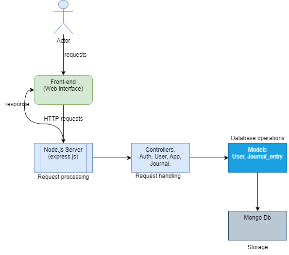

# JournalHub - (Backend)

**Don't lose your spark, Journal it!**

JournalHub is a sophisticated web application designed to help users capture and preserve their thoughts, ideas, and experiences. It's an ideal platform for individuals who want to keep a digital journal, reflect on their daily lives, or document their creative processes.

## Core Features

- **User Authentication**: Secure user registration and login with email verification.
- **Rich Text Editor**: A robust editor to create and format journal entries.
- **Tagging System**: Organize journal entries with tags for easy retrieval.
- **Search Functionality**: Quickly find journal entries by keywords.
- **Privacy Controls**: Set journal entries as private or public.
- **Responsive Design**: Accessible on both desktop and mobile devices.

## Building Blocks

JournalHub is built using modern web technologies:

- **Frontend**: (found_here: [GitHub]https://github.com/legennd48/journalhub-frontend.git)
  - **React**: For building the user interface.
  - **Redux**: For state management.
  - **React Router**: For navigation.
  - **CSS/SCSS**: For styling.
- **Backend**:
  - **Node.js**: For server-side logic.
  - **Express.js**: For handling HTTP requests.
  - **MongoDB**: For database storage.
  - **JWT**: For authentication.

## Architecture

JournalHub follows a modular architecture with a clear separation of concerns:

- **Client**: The frontend React application.
- **Server**: The backend Node.js application.
- **Database**: MongoDB for storing user data and journal entries.

The architecture diagram below illustrates the high-level structure of JournalHub:



### Architecture Analysis
- **User**: Interacts with the JournalHub web interface.
- **Frontend**: Sends requests to the Node.js server (Express.js) using HTTP requests.
- **Node.js Server (Express.js)**: Receives requests and routes them to controllers for processing.
- **Controllers**: Handle requests, interact with models for data access, and perform operations like user authentication and CRUD operations for journal entries.
- **Models**: Define the structure and behavior of data, interacting with the MongoDB database for data storage and retrieval.
- **MongoDB**: Stores user and journal entry data.
- **Response**: The server sends response data back to the frontend for display.
JournalHub adopts the Model-View-Controller (MVC) pattern, with a Node.js server and a MongoDB database.

## Installation

### Requirements

- **Node.js** (v14.x or higher)
- **MongoDB** (local or cloud instance)

### Steps

1. **Clone the Repository**:
    ```bash
    git clone https://github.com/yourusername/JournalHub.git
    cd JournalHub
    ```

2. **Install Dependencies**:
    ```bash
    npm install
    ```

3. **Set Up Environment Variables**:
    Create a `.env` file in the root directory and add the following:
    ```env
    MONGO_URI=your_mongodb_uri
    JWT_SECRET=your_jwt_secret
    ```

4. **Run the Application**:
    ```bash
    npm start
    ```

    The application will be available at `http://localhost:5000`.

## Endpoints and Usage

### Authentication

- **Register**:
    ```bash
    curl -X POST http://localhost:5000/api/auth/register -H "Content-Type: application/json" -d '{"name": "user name", "email":"user@example.com", "password":"password"}'
    ```

- **Login**:
    ```bash
    curl -X POST http://localhost:5000/login -H "Content-Type: application/json" -d '{"email":"user@example.com", "password":"password"}'
    ```

- **Logout**:
    ```bash
    curl -X POST http://localhost:5000/logout \
    -H "Authorization: Bearer <token>"
    ```

### Journal Entries

- **Create Journal Entry**:
    ```bash
    curl -X POST http://localhost:5000/journalEntries \
    -H "Authorization: Bearer <token>" \
    -H "userId: <user_id>" \
    -H "Content-Type: application/json" \
    -d '{ "date": "2024-06-27T00:00:00z", "title": "", "content": "" }'
    ```

- **Get Journal Entries**:
    ```bash
    curl -X GET http://localhost:5000/journalEntries/user/<used_id> \
    -H "Authorization: Bearer <token>"
    -H "userId: <user_id>"
    ```

- **Get Single Journal Entry**:
    ```bash
    curl -X GET http://localhost:5000/journalEntries/<entry_id> \
    -H "Authorization: Bearer <token>" \
    -H "userId: <user_id>"

    ```

- **Update Journal Entry**:
    ```bash
    curl -X PUT http://localhost:5000/JournalEntries/:id \
    -H "Authorization: Bearer your_jwt_token" \
    -H "Content-Type: application/json" \
    -d '{"title":"Updated Title", "content":"Updated content."}'
    ```

- **Delete Journal Entry**:
    ```bash
    curl -X DELETE http://localhost:5000/JournalEntries/:id \
    -H "Authorization: Bearer your_jwt_token"
    ```

### User Profile
- **Update user profile**
    ```bash
    curl -X PUT http://localhost:5000/profile/<user_id> \
    -H "Authorization: Bearer <token>" \
    -H "Content-Type: application/json" \
    -d '{"name": "new name", "email": "new email"}'
    ```

- **Get user profile by id **
    ```bash
    curl -X GET http://localhost:5000/profile/<userId> \
    -H "Authorization: Bearer <token>"
    ```

- **Update user profile**
    ```bash
    curl -X PUT http://localhost:5000/profile/<user_id> \
    -H "Authorization: Bearer <token>" \
    -H "Content-Type: application/json" \
    -d '{"name": "new name", "email": "new email"}'
    ```

- **Delete user profile**
    ```bash
    curl -X DELETE http://localhost:5000/profile/<user_id> \
    -H "Authorization: Bearer <token>"
    ```

### Check Stats

- **Get total number of users and entries**
    ```bash
    curl -X GET http://localhost:5000/stats
    ```

- **Get total number of entries by user **
    ```bash
    curl -X GET http://localhost:5000/user/entries/<user_id>
    ```

### Tags

- **Add Tag to Journal Entry**:
    ```bash
    curl -X POST http://localhost:5000/api/journals/:id/tags -H "Authorization: Bearer your_jwt_token" -H "Content-Type: application/json" -d '{"tag":"MyTag"}'
    ```

- **Remove Tag from Journal Entry**:
    ```bash
    curl -X DELETE http://localhost:5000/api/journals/:id/tags/:tag -H "Authorization: Bearer your_jwt_token"
    ```

## Contribution

We welcome contributions to JournalHub! To contribute:

1. **Fork the repository**:
    Click on the 'Fork' button at the top right corner of this repository page.

2. **Clone your forked repository**:
    ```bash
    git clone https://github.com/yourusername/JournalHub.git
    cd JournalHub
    ```

3. **Create a new branch**:
    ```bash
    git checkout -b feature-branch
    ```

4. **Make your changes** and **commit**:
    ```bash
    git add .
    git commit -m "Description of the feature or fix"
    ```

5. **Push to your forked repository**:
    ```bash
    git push origin feature-branch
    ```

6. **Open a Pull Request**:
    Go to the original repository and open a pull request with a detailed description of your changes.

## Licensing

JournalHub is licensed under the MIT License. See the [LICENSE](./LICENSE) file for more details.

## Authors
- Abdulrazzaq Liasu (Project lead) [Github](https://github.com/legennd48)
- Monwabisi Ndlovu (Backend) [Github](https://github.com/Monwabisindlovu)
- Salami Oluwatosin (Backend) [Github](https://github.com/LusterPearl)

## Similar Projects

Here are some related projects that might interest you:

- [DiaryApp](https://github.com/example/DiaryApp): Another open-source diary application.
- [NotesHub](https://github.com/example/NotesHub): A web application for managing notes and to-do lists.

---

Thank you for using JournalHub! We hope it helps you capture and preserve your most precious thoughts and experiences.
